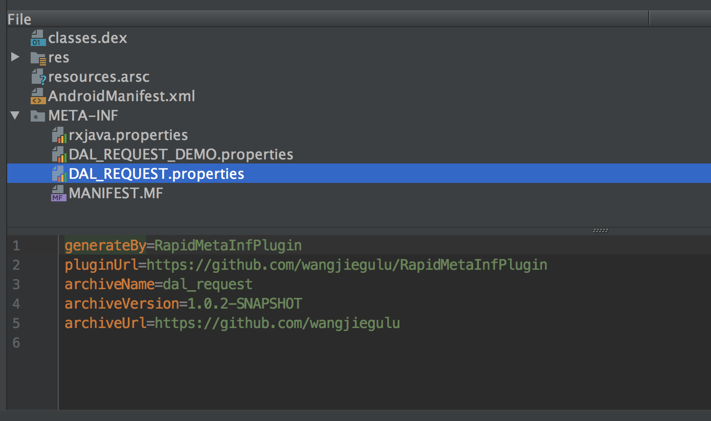

# RapidMetaInfPlugin

Android Gradle Plugin for add generate file to META-INF folder in apk.



## 1. How to use

Add `rapid meta inf plugin` to `build.gradle` of root project **([Check newest version](http://search.maven.org/#search%7Cga%7C1%7CRapidMetaInfPlugin))**:

```groovy
buildscript {
    repositories {
        jcenter()
        google()
    }
    dependencies {
        // ...
        classpath ('com.github.wangjiegulu:rapidmetainf:x.x.x'){
            exclude group: 'com.android.tools.build', module: 'gradle'
        }
    }
}
```

In your `build.gradle`(app or android library):

```groovy
apply plugin: 'com.github.wangjiegulu.plg.rapidmetainf'

rapidmetainf {
    metaInfName 'DAL_REQUEST.properties'
    metaInfProperties "archiveName=$dbarchiveName",
            "archiveVersion=$dbarchiveVersion",
            "archiveUrl=$dbarchiveUrl"
}
```

Build project, you will find a genereated file in `buildDir/generated/rapidmetainf/META-INF/DAL_REQUEST.properties`:

```
generateBy=RapidMetaInfPlugin
pluginUrl=https://github.com/wangjiegulu/RapidMetaInfPlugin
archiveName=dal_request
archiveVersion=1.0.2-SNAPSHOT
archiveUrl=https://github.com/wangjiegulu
```

In output apk:


License
=======


```
Copyright 2018 Wang Jie

Licensed under the Apache License, Version 2.0 (the "License");
you may not use this file except in compliance with the License.
You may obtain a copy of the License at

   http://www.apache.org/licenses/LICENSE-2.0

Unless required by applicable law or agreed to in writing, software
distributed under the License is distributed on an "AS IS" BASIS,
WITHOUT WARRANTIES OR CONDITIONS OF ANY KIND, either express or implied.
See the License for the specific language governing blacklist and
limitations under the License.
```


